<h1 align="center">CSS Notes</h1>

### 0.1. Table of Contents
- [1. CSS Introduction](#1-css-introduction)
  - [1.1. How To Add CSS](#11-how-to-add-css)
  - [1.2. CSS Comments](#12-css-comments)
- [2. variables](#2-variables)
- [3. Cascading order and Specificity](#3-cascading-order-and-specificity)
  - [3.1. Cascading Order](#31-cascading-order)
  - [3.2. Specificity](#32-specificity)
- [4. Text Formatting](#4-text-formatting)
  - [4.1. text-color](#41-text-color)
  - [4.2. text-alignment](#42-text-alignment)
  - [4.3. text-direction:](#43-text-direction)
  - [4.4. text-decoration:](#44-text-decoration)
  - [4.5. Text-transformation:](#45-text-transformation)
  - [4.6. letter-spacing:](#46-letter-spacing)
  - [4.7. word-spacing:](#47-word-spacing)
  - [4.8. line-height:](#48-line-height)
  - [4.9. text-shadow:](#49-text-shadow)
  - [4.10. font-size:](#410-font-size)
  - [4.11. font-weight:](#411-font-weight)
- [5. Margin](#5-margin)
  - [5.1. margin: auto;](#51-margin-auto)
  - [5.2. Margin Collapse](#52-margin-collapse)
- [6. Border](#6-border)
- [7. Padding](#7-padding)
- [8. Box-Modal](#8-box-modal)
  - [8.1. box-sizing: border-box](#81-box-sizing-border-box)
- [9. Background Properties](#9-background-properties)
- [10. Units](#10-units)
- [11. Selectors](#11-selectors)
  - [11.1. Simple Selectors](#111-simple-selectors)
    - [11.1.1. Element Selector](#1111-element-selector)
    - [11.1.2. Id Selector](#1112-id-selector)
    - [11.1.3. Class Selector](#1113-class-selector)
    - [11.1.4. Universal Selector](#1114-universal-selector)
    - [11.1.5. Groping Selector](#1115-groping-selector)
  - [11.2. Combinator Selectors](#112-combinator-selectors)
    - [11.2.1. Descendant Combinator](#1121-descendant-combinator)
    - [11.2.2. Child Combinator](#1122-child-combinator)
  - [11.3. Pseudo-class Selectors](#113-pseudo-class-selectors)
    - [11.3.1. :link, :visited, :hover, :active](#1131-link-visited-hover-active)
    - [11.3.2. :hover](#1132-hover)
    - [11.3.3. input:focus](#1133-inputfocus)
    - [11.3.4. :nth-child()](#1134-nth-child)
  - [11.4. Pseudo-elements selectors](#114-pseudo-elements-selectors)
    - [11.4.1. ::before, ::after, ::first-letter, ::first-line](#1141-before-after-first-letter-first-line)
  - [11.5. Attribute selectors](#115-attribute-selectors)
    - [11.5.1. `[type="text"]`, `[target="_blank"]`](#1151-typetext-target_blank)
    - [11.5.2. `[class^="btn-"]`](#1152-classbtn-)
- [12. Table](#12-table)
- [13. Display Property](#13-display-property)
- [14. Position Property](#14-position-property)
  - [14.1. static(default):](#141-staticdefault)
  - [14.2. Relative:](#142-relative)
  - [14.3. absolute:](#143-absolute)
  - [14.4. Sticky:](#144-sticky)
  - [14.5. Fixed:](#145-fixed)
- [15. z-index property](#15-z-index-property)
- [16. Overflow](#16-overflow)
- [17. Opacity](#17-opacity)
- [18. Box shadow](#18-box-shadow)
  - [18.1. Specify a color for the shadow:](#181-specify-a-color-for-the-shadow)
  - [18.2. Add a blur effect to the shadow:](#182-add-a-blur-effect-to-the-shadow)
  - [18.3. Set the spread radius of the shadow:](#183-set-the-spread-radius-of-the-shadow)
  - [18.4. Set the inset parameter:](#184-set-the-inset-parameter)
- [19. Media Queries](#19-media-queries)
  - [19.1. CSS Media Types:](#191-css-media-types)
  - [19.2. CSS Media Features:](#192-css-media-features)
  - [19.3. Syntax:](#193-syntax)
  - [19.4. Fully responsive media queries breakpoints:](#194-fully-responsive-media-queries-breakpoints)
- [20. flex](#20-flex)
  - [20.1. Container Properties:](#201-container-properties)
  - [20.2. justify-content](#202-justify-content)
  - [20.3. align-items](#203-align-items)
  - [20.4. align-content](#204-align-content)
  - [20.5. flex-warp](#205-flex-warp)
  - [20.6. flex-direction](#206-flex-direction)
  - [20.7. flex-flow](#207-flex-flow)
  - [20.8. Items Properties:](#208-items-properties)
  - [20.9. order](#209-order)
  - [20.10. flex-grow](#2010-flex-grow)
  - [20.11. flex-shrink](#2011-flex-shrink)
  - [20.12. flex-basis](#2012-flex-basis)
  - [20.13. flex](#2013-flex)
    - [20.13.1. flex:1;](#20131-flex1)
  - [20.14. align-self](#2014-align-self)
  - [20.15. Example:](#2015-example)
    - [20.15.1. Perfect Centering with justify-content and align-items](#20151-perfect-centering-with-justify-content-and-align-items)
    - [20.15.2. Perfect Centering with margin: auto;](#20152-perfect-centering-with-margin-auto)
- [21. Grid](#21-grid)
  - [21.1. Grid Container](#211-grid-container)
  - [21.2. grid-template-columns](#212-grid-template-columns)
  - [21.3. grid-template-rows](#213-grid-template-rows)
  - [21.4. justify-content](#214-justify-content)
    - [21.4.1. justify-content: space-evenly:](#2141-justify-content-space-evenly)
    - [21.4.2. justify-content: space-around;](#2142-justify-content-space-around)
    - [21.4.3. justify-content: space-between;](#2143-justify-content-space-between)
    - [21.4.4. justify-content: center;](#2144-justify-content-center)
    - [21.4.5. justify-content: start (default);](#2145-justify-content-start-default)
    - [21.4.6. justify-content: end;](#2146-justify-content-end)
  - [21.5. align-content](#215-align-content)
    - [21.5.1. align-content: space-evenly:](#2151-align-content-space-evenly)
    - [21.5.2. align-content: space-around;](#2152-align-content-space-around)
    - [21.5.3. align-content: space-between;](#2153-align-content-space-between)
    - [21.5.4. align-content: center;](#2154-align-content-center)
    - [21.5.5. align-content: start;](#2155-align-content-start)
    - [21.5.6. align-content: end;](#2156-align-content-end)
    - [21.5.7. align-content: stretch (default)](#2157-align-content-stretch-default)
  - [21.6. place-content](#216-place-content)
  - [21.7. Grid Items](#217-grid-items)
  - [21.8. grid-column-start, grid-column-end and grid-column](#218-grid-column-start-grid-column-end-and-grid-column)
  - [21.9. grid-row-start, grid-row-end, grid-row](#219-grid-row-start-grid-row-end-grid-row)
  - [21.10. grid-area](#2110-grid-area)
  - [21.11. justify-self, align-self, place-self](#2111-justify-self-align-self-place-self)
    - [21.11.1. justify-self](#21111-justify-self)
    - [21.11.2. align-self](#21112-align-self)
    - [21.11.3. place-self](#21113-place-self)
  - [21.12. Grid Tricks:](#2112-grid-tricks)
    - [21.12.1. repeat() function](#21121-repeat-function)
    - [21.12.2. Difference between 1fr and auto](#21122-difference-between-1fr-and-auto)
    - [21.12.3. Difference between auto-fill, auto-fit and 1fr:](#21123-difference-between-auto-fill-auto-fit-and-1fr)
    - [21.12.4. grid-template-areas and grid area:](#21124-grid-template-areas-and-grid-area)
    - [21.12.5. Simple Layout using grid:](#21125-simple-layout-using-grid)
    - [21.12.6. Example-1:](#21126-example-1)
    - [21.12.7. Example-2:](#21127-example-2)
    - [21.12.8. Example-3:](#21128-example-3)
- [22. Transition](#22-transition)
  - [22.1. transition-timing-function](#221-transition-timing-function)


## 1. CSS Introduction
CSS = Cascading Style Sheets

It is a stylesheet language used to describe the presentation of a document written in HTML. CSS controls the layout, design, and visual presentation of web pages.


- The selector pints to the HTML element you want to style.
- The Declaration block contains one or more declarations separated by semicolons and surrounded by curly braces.  Each Declaration includes a CSS property name and a value, separated by a colon.

### 1.1. How To Add CSS

 There are three ways of inserting a style sheet:

1. Inline CSS
   
```<h1 style="color: red;">Inline CSS</h1>```

2. Internal CSS
```html
<head>
    <meta charset="UTF-8">
    <meta name="viewport" content="width=device-width, initial-scale=1.0">
    <title>Document</title>
    <style>
        h1{
            color: red;
        }
    </style>
</head>
```
3. External CSS
```html
<head>
    <meta charset="UTF-8">
    <meta name="viewport" content="width=device-width, initial-scale=1.0">
    <title>Document</title>
    <link rel="stylesheet" href="style.css">
</head>
```
```css
h1{
    color: red;
}
```

### 1.2. CSS Comments
```css
/* This is a single line comments */

/* This is 
a multi-line
comment */
```

## 2. variables
A CSS variable (also called a custom property) is a reusable value that you define once and use multiple times in your CSS. CSS variables are usually defined inside the :root selector so that they are available globally.

```css
:root{
    --main-color: blue:
    --main-font: 20px; 
}

body{
    background-color: var(--main-color);
    font-size: var(--main-font);
}
```

## 3. Cascading order and Specificity
### 3.1. Cascading Order 
The cascading order determines which style sheet apply to the html based on priority.
- 1st priority = Inline CSS
- 2nd priority = Internal CSS
- 3rd priority = External CSS

### 3.2. Specificity

If there are two or more CSS rules that point to the same element, the selector with the highest specificity will win, and its style declaration will be applied to that HTML element.

- 1st priority = Inline CSS
- 2nd priority = Id selector (#navbar, #hero-section)
- 3rd priority = Classes and pseudo-classes selector (.test, :hover)
- 4th priority = Elements and pseudo-elements selector (h1, ::before, ::after)

Example 1: Here, we define a class .test with green color and a p element with red color. Since the class selector has higher specificity than the element selector, the text will appear green.

```html
<!DOCTYPE html>
<html>
<head>
    <style>
        .test {
            color: green;
        }
        p {
            color: red;
        }
    </style>
</head>
<body>
    <p class="test">Hello World!</p>
</body>
</html>
```


Example 2:  In this case, we have:
- .test (class selector, priority: medium) → Green
- p (element selector, priority: low) → Red
- #demo (ID selector, highest priority) → Blue
Since ID selectors have the highest specificity, the text will be blue, overriding both the class and element selectors.

```html
<!DOCTYPE html>
<html lang="en">
<head>
    <meta charset="UTF-8">
    <meta name="viewport" content="width=device-width, initial-scale=1.0">
    <title>Document</title>
    <style>
        .test{
            color:green;
        }
        p{
            color:red;
        }
        #demo{
            color: blue;
        }
    </style>
</head>
<body>
    <p id="demo" class="test">Hello World!</p>
</body>
</html>
```


Example 3: If both have equal specificity the latest rule wins.

```html
<!DOCTYPE html>
<html lang="en">
<head>
    <meta charset="UTF-8">
    <meta name="viewport" content="width=device-width, initial-scale=1.0">
    <title>Document</title>
    <style>
        h1{
            background-color: yellow;
        }
        h1{
            background-color: red;
        }
    </style>
</head>
<body>
    <h1>Heading 1</h1>
</body>
</html>
```


## 4. Text Formatting
### 4.1. text-color
- color: value; 
### 4.2. text-alignment
- text-alignment: left(default),center, right, justify

  

### 4.3. text-direction:
```css
  p.ex1 {
            direction: rtl;
            unicode-bidi: bidi-override;
        }
```	
  

```css
    p.ex1 {
            direction: rtl;
        }
```
  

### 4.4. text-decoration:	

```css
        h1 {
            text-decoration: overline;
        }


        h2 {
            text-decoration: line-through;
        }


        h3 {
            text-decoration: underline;
        }


        h4 {
            text-decoration: none; /* (Removes any default text decoration, useful for removing links and lists default decoration)*/
        }
```

  

### 4.5. Text-transformation:

```css
        h1 {
            text-transform: uppercase;
        }


        h2 {
            text-transform: capitalize;
        }


        h3 {
            text-transform: lowercase;
        }
```

  

### 4.6. letter-spacing:	

```css
 h1 {
            letter-spacing: -3px;
        }


        p {
            letter-spacing: 10px;
        }
```
  

### 4.7. word-spacing:	

```css
        p.normal{
            word-spacing: normal;
        }


        p.wide {
            word-spacing: 10px;
        }


        p.narrow {
            word-spacing: -2px;
        }

```

  

### 4.8. line-height:	

```css
        p {
            line-height: 80px;
        }
```


### 4.9. text-shadow:	
first 2px specify the  horizontal shadow and the 2nd 2px specify the vertical shadow:

```css
  h1 {
            text-shadow: 2px 2px;
        }
```

  

Next, add color (red) to the shadow:

```css
        h1 {
            text-shadow: 2px 2px red;
        }
```


Then, add a blur effect (5px) to the shadow:

```css
        h1 {
            text-shadow: 2px 2px 5px red;
        }
```


### 4.10. font-size:

- font-size: value;
  
### 4.11. font-weight:

- 100(thin)
- 200(extra-light)
- 300(light)
- 400(regular)
- 500(medium)
- 600(semi bold)
- 700(bold)
- 800(extrabold)
- 900(black)


## 5. Margin
The CSS margin properties are used to crate space around outside the elements. 
- margin-top
- margin-right
- margin-bottom
- margin-left

To shorten the code, it is possible to specify all the margin properties in one property. 
- margin: 25px 50px 75px 100px;
  - top margin is 25px
  - right margin is 50px
  - bottom margin is 75px
  - left margin is 100px

if the margin property had three values:
  - margin: 25px 50px 75px;
  - top margin is 25px
  - right and left margins are 50px
  - bottom margin is 75px
  
if the margin property has two values:
  - margin: 25px 50px;
  - top and bottom margins are 25px
  - right and left margins are 50px

if the margin property has one value:
  - margin: 25px;
all four margins are 25px


### 5.1. margin: auto;
You can set the margin property to auto to horizontally center the element within its container. The element will then take up the specified width, and the remaining space will be split equally between the left and right margins.

```css
        div {
            border: 1px solid red;
            width: 300px;
            margin: auto;
        }
```


### 5.2. Margin Collapse
Top and bottom margins of elements are sometimes collapsed into a single margin that is equal to the largest of the two margins. This does not happen on left and right margins! Only top and bottom margins!
In the below example, the `<h1>` element has a bottom margin of 50px and the `<h2>` element has a top margin set to 20px. Common sense would seem to suggest that the vertical margin between the `<h1>` and the `<h2>` would be a total of 70px (50px + 20px). But due to margin collapse, the actual margin ends up being 50px.

```css
        h1 {
            margin: 0 0 50px 0;
        }


        h2 {
            margin: 20px 0 0 0;
        }
```


## 6. Border
The border property is a shorthand property for the following individual border properties:
- border-width
- border-style
- border-color

```css
  p {
            border: 5px solid red;
        }
```
```css
        p {
            border-left: 5px solid red;
        }
```
```css
        p {
            border-style: solid;
            border-right-color: red;
        }
```
```css
       p {
            border: 5px solid red;
            border-radius: 10px;
        }
```


## 7. Padding
Padding is used to create space inside an element, between its content and border (if any). Padding Increases the inner space of an element and it does not affect the element’s margin. There are properties for setting the padding for each side of an element:
- padding-top
- padding-right
- padding-bottom
- padding-left
Note: The padding doesn’t have auto value.

To shorten the code, it is possible to specify all the padding properties in one property. 

```css
        div {
            padding: 25px 50px 75px 100px;
            border: 1px solid red;
        }
```


## 8. Box-Modal
In CSS, the term box model is used when taking about design and layout. The CSS box model is essentially a box that warps around every HTML element. It consists of: content, padding, borders, and margins. The image below illustrates the box model:


Example 1:


### 8.1. box-sizing: border-box 
By default, when we set width and height for an element, only the content inside the element gets that size. However, if we add padding and borders, they increase the total size of the element, often breaking layouts. 

```css
        .div1 {
            width: 300px;
            height: 100px;
            border: 1px solid red;
            margin-bottom: 10px;
        }


        .div2 {
            width: 300px;
            height: 100px;
            border: 1px solid red;
            padding: 25px;
        }
```


When we apply box-sizing: border-box;, the total width and height include content, padding, and border.

```css
        .div1 {
            width: 300px;
            height: 100px;
            border: 1px solid red;
            margin-bottom: 10px;
            box-sizing: border-box;
        }


        .div2 {
            width: 300px;
            height: 100px;
            border: 1px solid red;
            padding: 25px;
            box-sizing: border-box;
        }
```


**Note:** it’s recommended to apply these CSS in globally:

```css
        * {
            margin: 0;
            padding: 0;
            box-sizing: border-box;
        }
```

## 9. Background Properties
- background-color: value;
- background-image: url(“”);
if you want to add multiple background images, it will be separated by commas.

```html
<head>
    <style>
        div {
            width: 600px;
            height: 300px;
            border: 1px solid red;
            background-image: url(assets/boy.svg), url(assets/ring.svg);
            background-position: right bottom, left top;
            background-repeat: no-repeat, no-repeat;
        }
    </style>
</head>

```


Multiple background images can be specified using the background shorthand property.

```html
    <style>
        div {
            width: 600px;
            height: 300px;
            border: 1px solid red;
            background: url(assets/boy.svg) no-repeat right bottom, url(assets/ring.svg) no-repeat left top;
        }
    </style>
```

- background-position: top, bottom, left, right, center;    
  you can also use them: top left, top center, top right, bottom right, 50px 100px, 20% 40%, top 30px left20px
- background-repeat: no-repeat, repeat, repeat-x, repeat-y;
- background-size: length, percentages, auto(default), cover, contain;


cover tells the browser to make sure the image always covers the entire container, even if it has to stretch the image or cut a little bit off one of the edges. contain, on the other hand, says to always show the whole image, even if that leaves a little space to the sides or bottom.

- background-position-x: center, left, right;
- background-position-y: center, top, bottom;
- background-attachment: fixed, scroll (default);

```html
   <style>
        body {
            background-image: url(assets/boy.svg);
            background-repeat: no-repeat;
            background-attachment: fixed;
        }
    </style> 
```


  

## 10. Units
There are two types of length units: absolute and relative.
- Absolute
    - px 
- Relative
    - % = Relative to the parent element.
    - rem = relative to font-size of the root element (2rem means 2 times the size of the current font based on the root font)
    - em = Relative to the font-size of the parent element (2em means 2 times the size of the current font based on the parent font)
        If the parent element font size is 10 px and then I set 2em to another element the 2em means = 10* 2 = 20px.sames rules for the rem
    
        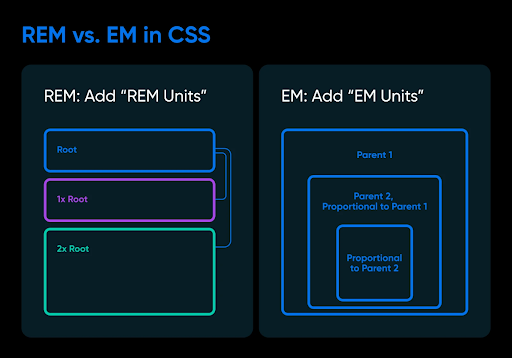  

    - vw = relative to 1% of the wide of the viewport. (Viewport = the browser window size. If the viewport is 50cm wide, 1vw = 0.5cm)
    
        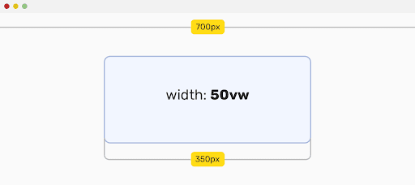  
    
    - vh = relative to 1% of the height of the viewport
    
        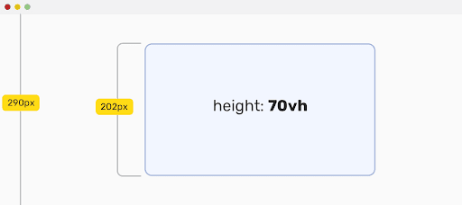

    - vmin = relative to 1% of viewport’s smaller dimension
    
        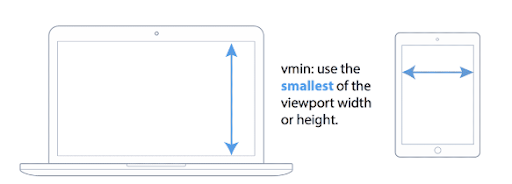
    
    - vmax = relative to 1% of viewport’s larger dimension 

        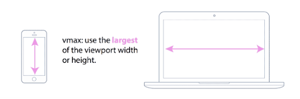


## 11. Selectors

A CSS selector selects the HMTL elements you want to style. We can divide CSS selectors into five categories:
- Simple Selectors (element, id, class, universal, groping selector)
- Combinator Selectors (descendant & child selector)
- Pseudo-class Selectors (:hover, :focus, :nth-child(), :first-child, :checked, :disabled, :visited, :active etc)
- Pseudo-elements Selectors (::before, ::after, ::first-letter, ::first-line etc)
- Attribute selectors ([type=”text”], [target=”_blank”], [class^=”btn-”] etc)

### 11.1. Simple Selectors
#### 11.1.1. Element Selector

```html
<!DOCTYPE html>
<html lang="en">


<head>
    <style>
        p {
            text-align: center;
            color: red;
        }
    </style>
</head>


<body>
    <p>Every paragraph will be affected by the style.</p>
    <p>Me too!</p>
    <p>And Me!</p>
</body>


</html>
```

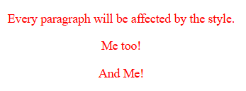

#### 11.1.2. Id Selector

```html
<!DOCTYPE html>
<html lang="en">


<head>
    <style>
        #para1 {
            text-align: center;
            color: red;
        }
    </style>
</head>


<body>
    <p id="para1">Hello World!</p>
    <p>This paragraph is not affected by the style.</p>
</body>


</html>
```

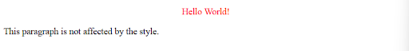

#### 11.1.3. Class Selector

```html
<!DOCTYPE html>
<html lang="en">


<head>
    <style>
        .center {
            text-align: center;
            color: red;
        }
    </style>
</head>


<body>
    <h1 class="center">Red and center-aligned heading.</h1>
    <p class="center">Red and center-aligned paragraph.</p>
</body>


</html>
```

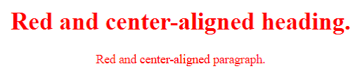

You can also specify that only specific HTML elements should be affected by a class. 

```html
<!DOCTYPE html>
<html lang="en">


<head>
    <style>
        p.center {
            text-align: center;
            color: red;
        }
    </style>
</head>


<body>
    <h1 class="center">Red and center-aligned heading.</h1>
    <p class="center">Red and center-aligned paragraph.</p>
</body>


</html>
```

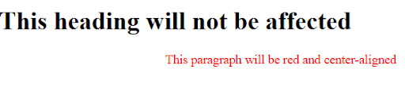

HTML elements can also refer to more than one class.

```html
<!DOCTYPE html>
<html lang="en">


<head>
    <style>
        p.center {
            text-align: center;
            color: red;
        }


        p.large {
            font-size: 300%;
        }
    </style>
</head>


<body>
    <h1 class="center">This heading will not be affected</h1>
    <p class="center">This paragraph will be red and center-aligned</p>
    <p class="center large">This paragraph will be red, center-aligned, and in a large font-size</p>
</body>


</html>
```


#### 11.1.4. Universal Selector

The universal selector (*) selects all HTML elements on the page.

```html
<!DOCTYPE html>
<html lang="en">


<head>
    <style>
        * {
            text-align: center;
            color: blue;
        }
    </style>
</head>


<body>
    <h1>Hello World!</h1>
    <p>Every element on the page will be affected by the style</p>
    <p id="para1">Me Too!</p>
    <p>And me!</p>
</body>


</html>
```

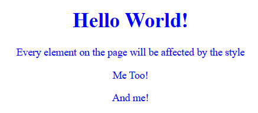


#### 11.1.5. Groping Selector

The grouping selector selects all the HTML elements with the same style definitions. Look at the following CSS code (the h1, h2, and p elements have the same style definitions):

```html
    <style>
        h1 {
            text-align: center;
            color: red;
        }


        h2 {
            text-align: center;
            color: red;
        }


        p {
            text-align: center;
            color: red;
        }
    </style>
```

It will be better to group the selectors, to minimize the code. To group selectors, separate each selector with a comma (,):

```html
<!DOCTYPE html>
<html lang="en">


<head>
    <style>
        h1,
        h2,
        p {
            text-align: center;
            color: red;
        }
    </style>
</head>


<body>
    <h1>Hello World</h1>
    <h2>Smaller heading</h2>
    <p>This is a paragraph</p>
</body>


</html>
```


### 11.2. Combinator Selectors
A combinator is something that explains the relationship between the selectors. There are many different combinators in CSS:

#### 11.2.1. Descendant Combinator

```html
<!DOCTYPE html>
<html lang="en">


<head>
    <style>
        div p {
            background-color: yellow;
        }
    </style>
</head>


<body>
    <div>
        <p>Selected descendant member 1</p>
        <p>Selected descendant member 2</p>
        <section>
            <h2>descendant member 3</h2>
            <p>Selected descendant member 4</p>
        </section>
    </div>
    <p>Paragraph 4 outside the div descendant</p>
    <p>Paragraph 5 in outside div descendant</p>
</body>


</html>
```

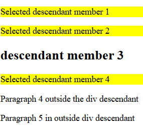

#### 11.2.2. Child Combinator

```html
<!DOCTYPE html>
<html lang="en">


<head>
    <style>
        div>p {
            background-color: yellow;
        }
    </style>
</head>


<body>
    <div>
        <p>Selected children 1 in the div parent</p>
        <p>Selected children 2 in the div parent</p>
        <h1>Selected children 3 in the div parent</h1>
        <section>
            <h2>children 1 in the section parent</h2>
            <p>children 2 in the section parent</p>
        </section>
        <p>Selected children 4 in the div parent</p>
    </div>
    <p>children 1 in the body parent</p>
    <p>children 2 in the body parent</p>
</body>


</html>
```

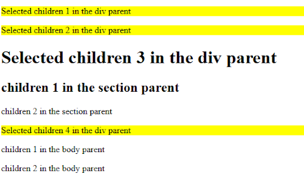

### 11.3. Pseudo-class Selectors
A pseudo-class is used to define a special state of an element. 
#### 11.3.1. :link, :visited, :hover, :active

In addition, links can be styled differently depending on what state they are in. 

By default, links will appear as follows in all browsers:

- An unvisited link is underlined and blue
- A visited link is underlined and purple
- An active link is underlined and red

You can edit the links with CSS in four states:

- a:link – a normal, unvisited 
- a:visited – a link the user has visited
- a:hover – a link when the user mouse over it
- a:active – a link the moment it is clicked

```css
      a:link {
            background-color: green;
            color: white;
            text-decoration: none;
        }


        a:visited {
            background-color: blue;
            color: white;
        }


        a:hover {
            background-color: red;
            color: white;
        }


        a:active {
            background-color: yellow;
            color: white;
        }
```

#### 11.3.2. :hover

```html
<!DOCTYPE html>
<html lang="en">


<head>
    <style>
        div p {
            background-color: green;
            color: white;
            padding: 25px;
            text-align: center;
            display: none;
            /* For hiding something */
        }


        div:hover p {
            display: block;
            /* for showing hidden items */
        }
    </style>
</head>


<body>
    <div>
        <h1>Hover Over me to show the p element</h1>
        <p>Teda! Here I am!</p>
    </div>
</body>


</html>
```

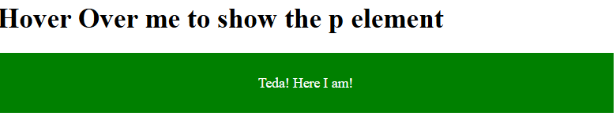

#### 11.3.3. input:focus

```html
<!DOCTYPE html>
<html lang="en">


<head>
    <style>
        input:focus {
            background-color: yellow;
        }
    </style>
</head>


<body>
    <form>
        <label for="name">Name</label>
        <input type="text" name="name" id="name">
    </form>


</body>


</html>
```

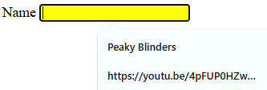

#### 11.3.4. :nth-child()

Even:

```html
<!DOCTYPE html>
<html lang="en">


<head>
    <style>
        li:nth-child(2n) {
            /* li:nth-child(even)*/
            background-color: red;
        }
    </style>
</head>


<body>
    <ol>
        <li>Founder</li>
        <li>CEO</li>
        <li>COO</li>
        <li>Senior Manager</li>
        <li>Manager</li>
    </ol>
</body>


</html>
```

Odd:

```html
<!DOCTYPE html>
<html lang="en">


<head>
    <style>
        li:nth-child(2n + 1) {
            /* li:nth-child(odd)*/
            background-color: red;
        }
    </style>
</head>


<body>
    <ol>
        <li>Founder</li>
        <li>CEO</li>
        <li>COO</li>
        <li>Senior Manager</li>
        <li>Manager</li>
    </ol>
</body>


</html>
```

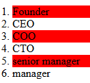

### 11.4. Pseudo-elements selectors
#### 11.4.1. ::before, ::after, ::first-letter, ::first-line
Adds content before text.

```html
    <style>
    .demo::before {
      content: "👉 ";
      color: blue;
    }
    
    .demo::after {
      content: " ✅";
      color: green;
    }
    
    .demo::first-letter {
      font-size: 30px;
      color: red;
      font-weight: bold;
    }
    
    .demo::first-line {
      text-transform: uppercase;
      background-color: yellow;
    }
    </style>

<p class="demo">
  Frontend development is fun and creative.
  You can design beautiful user interfaces with HTML, CSS, and JavaScript.
</p>

```

### 11.5. Attribute selectors

#### 11.5.1. `[type="text"]`, `[target="_blank"]`

```html
<style>
input[type="text"] {
  border: 2px solid blue;
}
</style>

<input type="text" placeholder="Name">
<input type="password" placeholder="Password">
```

```html
<style>
a[target="_blank"] {
  color: red;
}
</style>

<a href="https://google.com" target="_blank">Google</a>
<a href="https://yahoo.com">Yahoo</a>

```

#### 11.5.2. `[class^="btn-"]`

Selects elements with class names starting with "btn-".

```html
<style>
[class^="btn-"] {
  padding: 10px;
  border-radius: 5px;
}
</style>

<button class="btn-primary">Primary</button>
<button class="btn-secondary">Secondary</button>

```

## 12. Table

```css
   table,
        th,
        td {
            border: 1px solid black;
        }
```

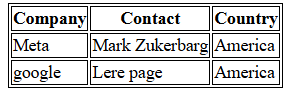

```css
       table,
        th,
        td {
            border: 1px solid black;
            border-collapse: collapse;
        }
```

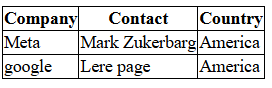

```css
 table,
        td,
        th {
            border: 1px solid black;
        }


        table {
            border-collapse: collapse;
            width: 100%;
        }


        td {
            text-align: center;
        }
```


```css
  table,
        td,
        th {
            border: 1px solid black;
        }


        table {
            border-collapse: collapse;
            width: 100%;
        }


        tr {
            height: 50px;
            vertical-align: bottom;
        }
```

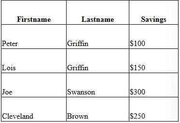

```css
        table,
        th,
        td {
            border: 1px solid black;
        }


        th,
        td {
            padding: 15px;
        }
```


```css
    table,
        th,
        td {
            border: 1px solid black;
        }


        table {
            border-spacing: 30px;
        }
```

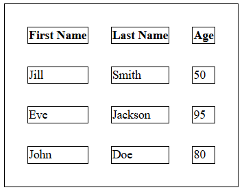

```css
  <table>
        <tr>
            <th colspan="2">Name</th>
            <th>Age</th>
        </tr>
        <tr>
            <td>Jill</td>
            <td>Smith</td>
            <td>50</td>
        </tr>
        <tr>
            <td>Eve</td>
            <td>Jackson</td>
            <td>95</td>
        </tr>
        <tr>
            <td>John</td>
            <td>Doe</td>
            <td>80</td>
        </tr>
    </table>
```

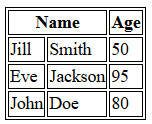

```css
<table>
        <tr>
            <th>Name</th>
            <td>Jill</td>
        </tr>
        <tr>
            <th rowspan="2">Phone</th>
            <td>555-1234</td>
        </tr>
        <tr>
            <td>555-8745</td>
        </tr>
    </table>
```

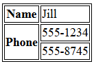

```css
   table {
            width: 100%;
        }


        th,
        td {
            text-align: center;
            padding: 8px;
        }


        tr:nth-child(even) {
            background-color: lightblue;
        }
```

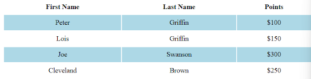

## 13. Display Property

- inline
- block
- inline-block
- none

```html
<!DOCTYPE html>
<html lang="en">


<head>
    <style>
        .inline {
            display: inline;
            background-color: lightblue;
            padding: 5px;
        }


        .block {
            display: block;
            background-color: lightgreen;
            padding: 10px;
            margin: 5px 0;
        }


        .inline-block {
            display: inline-block;
            background-color: lightcoral;
            padding: 10px;
            margin: 5px;
        }


        .none {
            display: none;
        }


        .container {
            border: 1px solid #000;
            padding: 10px;
        }
    </style>
</head>


<body>
    <div class="inline">This is inline</div>
    <div class="inline">Another inline</div>


    <span class="block">This is block</span>
    <span class="block">Another block</span>


    <div class="inline-block">This is inline-block</div>
    <div class="inline-block">Another inline-block</div>


    <div class="none">You can't see me (display: none)</div>
</body>


</html>
```

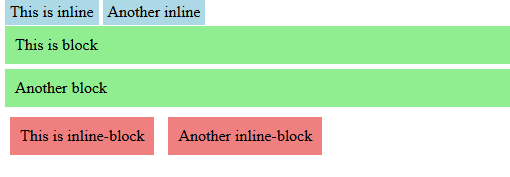

## 14. Position Property
### 14.1. static(default):

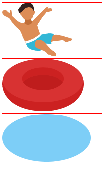

### 14.2. Relative:	
When we apply position: relative to an element, it stays in its original position within the document flow but allows us to move it around using properties like top, right, bottom, and left. The element's original space is still reserved, meaning other elements won't shift to take its place.

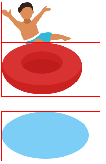

```html
    <div class="swim_container">
        <div class="box boy"></div>
        <div class="box ring"></div>
        <div class="box water"></div>
    </div>
CSS:
.box{
    border: 1px solid red;
    width: 200px;
}
.ring{
    position: relative;
    bottom: 30px;
}
```

### 14.3. absolute:	
When we apply position: absolute to an element, it is completely removed from its original position in the document flow. This allows us to move it around freely using properties like top, right, bottom, and left to base on her parent frame. However, since the element is no longer part of the normal flow, its original space is not reserved, causing other elements to shift and fill the gap.

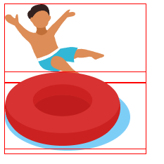

```css
.box{
    border: 1px solid red;
    width: 200px;
}
.ring{
    position: absolute;
    top: 105px;
}

```

### 14.4. Sticky:	
The position: sticky property allows an element to "stick" to a specific position within its parent container when the page is scrolled. It behaves like relative until a specified scroll position is reached, then it behaves like fixed. This is often used to keep elements like headers or navigation bars visible while scrolling.

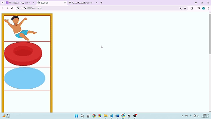


```css
.container{
    border: 10px solid goldenrod;
    height: 500px;
    width: 200px;
}
.container2{
    border: 10px solid red;
    height: 500px;
    width: 200px;
}
.box{
    border: 1px solid red;
    width: 200px;
}
.ring{
    position: sticky;
    top: 20px;
}
```

### 14.5. Fixed:	
The position: fixed are the same but it gives her space to other and follow the position to her parent.

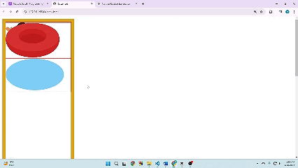


```css
.container{
    border: 10px solid goldenrod;
    height: 500px;
    width: 200px;
}
.container2{
    border: 10px solid red;
    height: 500px;
    width: 200px;
}
.box{
    border: 1px solid red;
    width: 200px;
}
.ring{
    position: fixed;
    top: 20px;
}
```


## 15. z-index property

```html
        <style>
        .box{
            position: absolute;
        }
        .boy{
            z-index: 3;
        }
        .ring{
            z-index: 2;
            top: 45px;
        }
        .water{
            z-index: 1;
            top: 60px;
        }
        </style>

    <div>
        <div class="box boy"></div>
        <div class="box ring"></div>
        <div class="box water"></div>
    </div>
```


## 16. Overflow

The CSS overflow property controls what happens to content that is too big to fit into an area. The overflow property only works for block elements with a specified height. 

The overflow property has the following values:

- visible(default)

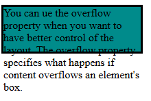  

- hidden
  
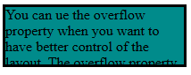    

- scroll 
  
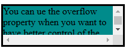  

- auto (Similar to scroll, but it adds scroll bars only when necessary)

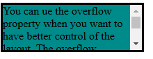

- overflow-x and overflow-y

```css
     div {
            background-color: darkcyan;
            width: 200px;
            height: 65px;
            border: 3px solid black;
            overflow-x: hidden;
            overflow-y: scroll;
        }
```

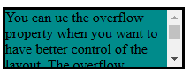
 


## 17. Opacity
The opacity property can take a value form 0.0 – 1.0. The lower the value, the more transparent: 

```css
        img {
            opacity: 0.5;
        }


        img:hover {
            opacity: 1.0;
        }
```

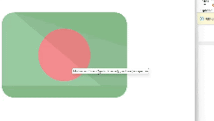

## 18. Box shadow
The CSS box-shadow property is used to apply one or more shadows to an element. 

**Specify a Horizontal and a Vertical shadow:**

The default color of the shadow is the current text-color.

```css
        div {
            width: 300px;
            height: 100px;
            background-color: coral;
            box-shadow: 10px 10px;
        }
```


**specify a color for the shadow:**

```css
        div {
            width: 300px;
            height: 100px;
            background-color: coral;
            box-shadow: 10px 10px lightblue;
        }
```


**Add a blur effect to the shadow:**

```css
        div {
            width: 300px;
            height: 100px;
            background-color: coral;
            box-shadow: 10px 10px 5px lightblue;
        }
```

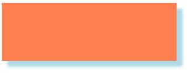

**Set the spread radius of the shadow:**

The spread parameter defines the spread radius. A positive value increases the size of the shadow, a negative value decreases the size of the shadow.

```css
        div {
            width: 300px;
            height: 100px;
            background-color: coral;
            box-shadow: 10px 10px 5px 12px lightblue;
        }
```

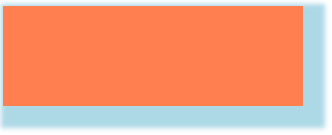

**Set the inset parameter:**

The inset parameter changes the shadow from an outer shadow to an inner shadow.

```css
        div {
            width: 300px;
            height: 100px;
            background-color: coral;
            box-shadow: 10px 10px 5px 12px lightblue inset;
        }
```

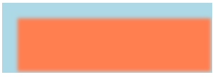


### 18.1. Specify a color for the shadow:	
### 18.2. Add a blur effect to the shadow:	
### 18.3. Set the spread radius of the shadow:	
### 18.4. Set the inset parameter:	


## 19. Media Queries

- max-width (Desktop-First) = works when the screen is at least this wide or smaller.

```css
/* Default (desktop) */
body { font-size: 18px; }

/* Tablet and smaller */
@media (max-width: 1024px) {
  body { font-size: 16px; }
}

/* Mobile */
@media (max-width: 768px) {
  body { font-size: 14px; }
}
```  
 
- min-width(Mobile first - recommended) = works when the screen is at least this wide or bigger.

```css
/* Default (mobile) */
body { font-size: 14px; }

/* Tablet and up */
@media (min-width: 768px) {
  body { font-size: 16px; }
}

/* Desktop and up */
@media (min-width: 1024px) {
  body { font-size: 18px; }
}
```

- max-height = maximum height of the viewport
- min-height = minimum heigh of the viewport
- width = width of the viewport (include scrollbar)
- height = height of the viewport (including scrollbar)

**Common breakpoints**

- Extra small (mobile): max-width: 600px

- Small (tablet portrait): min-width: 601px and max-width: 768px

- Medium (tablet landscape): min-width: 769px and max-width: 1024px

- Large (desktop): min-width: 1025px and max-width: 1440px

- Extra large (wide desktop): min-width: 1441px

### 19.1. CSS Media Types:	
### 19.2. CSS Media Features:	
### 19.3. Syntax:	
### 19.4. Fully responsive media queries breakpoints:


## 20. flex

### 20.1. Container Properties: 

### 20.2. justify-content
The justify-content property is used to align the flex items when they do not use all available space on the main-axis(horizontally).  

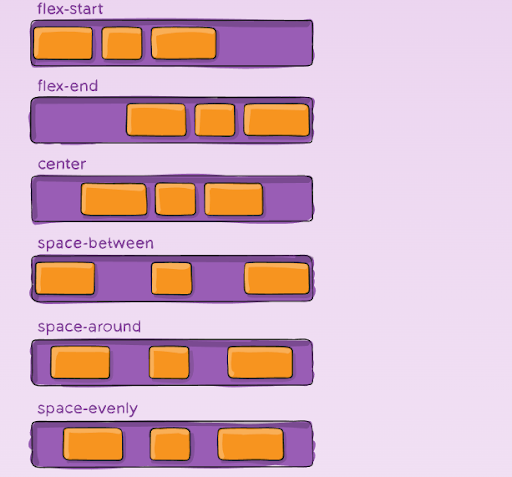

### 20.3. align-items
The align-items property is used to align the single-line flex items when they do not use all available space on the cross-axis (vertically).

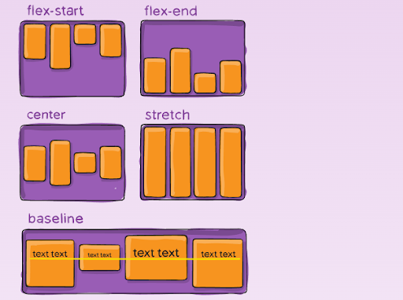

### 20.4. align-content
The align-content property is used to align the multiple-line flex items when they do not use all available space on the cross-axis(vertically).
**Note:** applies only when the flex-wrap is set to wrap or wrap-reverse. 


### 20.5. flex-warp
The flex-wrap property specifies whether the flex items should wrap or not, if there is not enough room for them on one flex line.

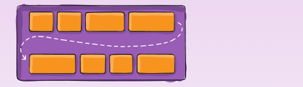

### 20.6. flex-direction
The flex-direction property specifies the display-direction of flex items in the flex container. 

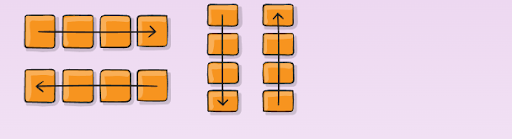

### 20.7. flex-flow 
The flex-flow property is a shorthand property for setting both the flex-direction and flex-wrap.


### 20.8. Items Properties:

### 20.9. order


The order property can change the order of the flex items. The order value must be a number, default value is 0.

```html
<!DOCTYPE html>
<html lang="en">


<head>
    <style>
        .flex-container {
            background-color: whitesmoke;
            display: flex;
        }


        .flex-container>div {
            background-color: dodgerblue;
            color: white;
            width: 100px;
            margin: 10px;
            text-align: center;
            line-height: 75px;
            font-size: 30px;
        }
    </style>
</head>


<body>
    <div class="flex-container">
        <div style="order: 3;">1</div>
        <div style="order: 2">2</div>
        <div style="order: 4;">3</div>
        <div style="order: 1;">4</div>
    </div>
</body>

</html>
```

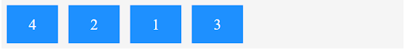

### 20.10. flex-grow

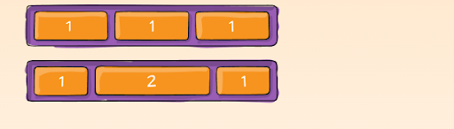

Controls how much a flex item grows to fill available space. A higher value means the item will take more space relative to others. The value must be a number, default value is 0 (does not grow).

```html
<!DOCTYPE html>
<html lang="en">


<head>
    <style>
        .flex-container {
            background-color: whitesmoke;
            display: flex;
        }


        .flex-container>div {
            background-color: dodgerblue;
            color: white;
            width: 100px;
            margin: 10px;
            text-align: center;
            line-height: 75px;
            font-size: 30px;
        }
    </style>
</head>


<body>
    <div class="flex-container">
        <div style="flex-grow: 1">1</div>
        <div style="flex-grow: 1">2</div>
        <div style="flex-grow: 8">3</div>
    </div>
</body>


</html>
```

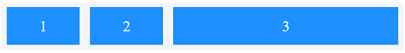

### 20.11. flex-shrink

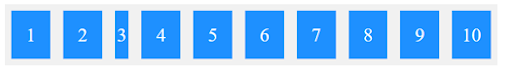

Controls how much a flex item shrinks when there is not enough space. A higher value means the item will shrink more. Default value is 1 (items shrink equally if needed).

```html
<!DOCTYPE html>
<html lang="en">


<head>
    <style>
        .flex-container {
            display: flex;
            align-items: stretch;
            background-color: #f1f1f1;
        }


        .flex-container>div {
            background-color: DodgerBlue;
            color: white;
            width: 100px;
            margin: 10px;
            text-align: center;
            line-height: 75px;
            font-size: 30px;
        }
    </style>
</head>


<body>
    <div class="flex-container">
        <div>1</div>
        <div>2</div>
        <div style="flex-shrink: 2">3</div>
        <div>4</div>
        <div>5</div>
        <div>6</div>
        <div>7</div>
        <div>8</div>
        <div>9</div>
        <div>10</div>
    </div>
</body>


</html>
```

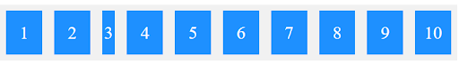

### 20.12. flex-basis


Defines the starting size of a flex item before any growing or shrinking occurs. Can be set in PX, %, or auto (default).

```html
<!DOCTYPE html>
<html lang="en">


<head>
    <style>
        .flex-container {
            display: flex;
            align-items: stretch;
            background-color: #f1f1f1;
        }


        .flex-container>div {
            background-color: DodgerBlue;
            color: white;
            width: 100px;
            margin: 10px;
            text-align: center;
            line-height: 75px;
            font-size: 30px;
        }
    </style>
</head>


<body>
    <div class="flex-container">
        <div>1</div>
        <div>2</div>
        <div style="flex-basis:200px">3</div>
        <div>4</div>
    </div>
</body>


</html>
```


### 20.13. flex

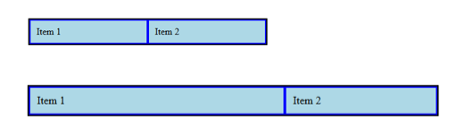

The flex property is a shorthand property for the flex-grow, flex-shrink and flex-basis properties.

In the first example, the container is 400px wide. Item 1 starts at 200px and can grow or shrink, but there is no extra space, so it stays 200px. Item 2 is also 200px and does not change. Both items fit exactly within 400px.

```html
<!DOCTYPE html>
<html lang="en">


<head>
    <style>
        .container {
            display: flex;
            width: 400px;
            border: 2px solid black;
        }


        .item {
            background: lightblue;
            padding: 10px;
            border: 2px solid blue;
        }
    </style>
</head>


<body>
    <div class="container">
        <div class="item" style="flex: 1 1 200px;">Item 1</div>
        <div class="item" style="flex-basis:200px;">Item 2</div>
    </div>


</body>


</html>
```


But in this example, the container is 600px wide. Item 2 remains 200px, but Item 1 grows to 400px because it can expand when extra space is available. 

```html
<style>
 .container {
  display: flex;
  width: 600px; 
  border: 2px solid black;
}

.item {
  background: lightblue;
  padding: 10px;
  border: 2px solid blue;
}
   
</style>

     <div class="container">
        <div class="item" style="flex: 1 1 200px;">Item 1</div>
        <div class="item" style="flex-basis:200px;">Item 2</div>
      </div>

```

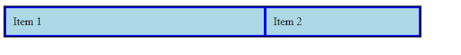

#### 20.13.1. flex:1;
flex: 1; is a shorthand for flex: 1 1 0%; which consists of three properties:  

- flex-grow: 1 → Allows the item to grow if extra space is available.
- flex-shrink: 1 → Allows the item to shrink if there’s not enough space.
- flex-basis: 0% → Sets the initial size of the item to 0%, meaning it takes up space based on the available room.

```html
<!DOCTYPE html>
<html lang="en">


<head>
    <style>
        .container {
            display: flex;
            border: 2px solid black;
            height: 100px;
        }


        .item {
            background: lightblue;
            padding: 10px;
            border: 2px solid blue;
        }


        .item1,
        .item2,
        .item3 {
            flex: 1;
        }
    </style>
</head>


<body>
    <div class="container">
        <div class="item item1">Item 1</div>
        <div class="item item2">Item 2</div>
        <div class="item item3">Item 3</div>
    </div>
</body>


</html>
```

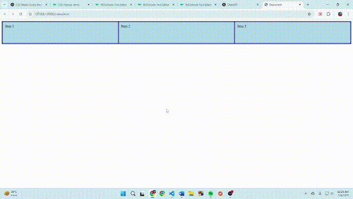

### 20.14. align-self
The align-self property overrides the default alignment set by the flex container. It has the following value:auto(default) | flex-start | flex-end | center | baseline | stretch;

```html
    <div class="container">
        <div class="item">Item 1</div>
        <div class="item">Item 2 (align-self: center)</div>
        <div class="item">Item 3</div>
      </div>
```

```css
. .container {
  display: flex;
  height: 200px;
  border: 2px solid black;
}

.item {
  width: 100px;
  height: 50px;
  background: lightblue;
  border: 1px solid blue;
}
.item:nth-child(2) {
  align-self: center;
}
```

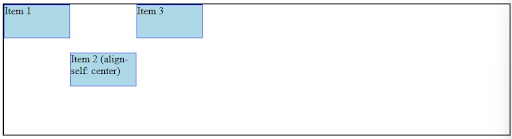


### 20.15. Example:
#### 20.15.1. Perfect Centering with justify-content and align-items

```css
.flex-container{
    background-color: dodgerblue;
    height: 600px;
    display: flex;
    justify-content: center;
    align-items: center;
}
.flex-container > div{
    background-color: whitesmoke;
    width: 100px;
    line-height: 75px;
    margin: 10px;
    text-align: center;
    font-size: 30px;
}
```

```html
    <div class="flex-container">
        <div>1</div>
    </div>
```


#### 20.15.2. Perfect Centering with margin: auto;

```css
.flex-container{
    background-color: dodgerblue;
    height: 600px;
    display: flex;
    /* justify-content: center;
    align-items: center; */
}
.child{
    background-color: whitesmoke;
    width: 100px;
    line-height: 75px;
    margin: 10px;
    text-align: center;
    font-size: 30px;
    margin: auto; /*magic*/
}
```

```html
    <div class="flex-container">
        <div class="child">1</div>
    </div>
```


## 21. Grid
### 21.1. Grid Container

### 21.2. grid-template-columns
specifies the size of the columns, and how many columns in a grid layout.

```css
        .grid_container {
            background-color: dodgerblue;
            padding: 10px;
            display: grid;
            grid-template-columns: auto auto auto auto;
        }
        .grid_item {
            background-color: whitesmoke;
            border: 1px solid black;
            padding: 10px;
            font-size: 30px;
            text-align: center;
        }
```


```css
 .grid_container {
            background-color: dodgerblue;
            padding: 10px;
            display: grid;
            grid-template-columns: 80px 200px auto 40px;
        }
        .grid_item {
            background-color: whitesmoke;
            border: 1px solid black;
            padding: 10px;
            font-size: 30px;
            text-align: center;
        }
```


### 21.3. grid-template-rows
specifies the size of the rows.

**Note:** 
it won't work properly unless grid-template-columns is also defined. It is mainly used for sizing the rows in the grid layout

```css
  .grid_container {
            background-color: dodgerblue;
            padding: 10px;
            display: grid;
            grid-template-columns: auto auto;
            grid-template-rows: 50px 100px 150px 200px;
        }


        .grid_item {
            background-color: whitesmoke;
            border: 1px solid black;
            padding: 10px;
            font-size: 30px;
            text-align: center;
        }
```


### 21.4. justify-content
Horizontally aligns the whole grid inside the container (when the total grid size is smaller than container)

#### 21.4.1. justify-content: space-evenly:

```css
        .grid_container {
            background-color: dodgerblue;
            padding: 10px;
            display: grid;
            grid-template-columns: 50px 50px 50px;
            justify-content: space-evenly;
        }


        .grid_item {
            background-color: whitesmoke;
            border: 1px solid black;
            padding: 10px;
            font-size: 30px;
            text-align: center;
        }
```


#### 21.4.2. justify-content: space-around;


#### 21.4.3. justify-content: space-between;


#### 21.4.4. justify-content: center;


#### 21.4.5. justify-content: start (default);


#### 21.4.6. justify-content: end;


### 21.5. align-content
Vertically aligns the whole grid inside the container (when the total grid size is smaller than the container)

#### 21.5.1. align-content: space-evenly:

```css
        .grid_container {
            background-color: dodgerblue;
            padding: 10px;
            height: 400px;
            display: grid;
            grid-template-columns: auto auto auto;
            align-content: space-evenly;
        }
        .grid_item {
            background-color: whitesmoke;
            border: 1px solid black;
            padding: 10px;
            font-size: 30px;
            text-align: center;
        }
```


#### 21.5.2. align-content: space-around;


#### 21.5.3. align-content: space-between;


#### 21.5.4. align-content: center;


#### 21.5.5. align-content: start;


#### 21.5.6. align-content: end;


#### 21.5.7. align-content: stretch (default)


### 21.6. place-content
The place-content property is a shorthand property of the align-content and the justify-content properties. This can be useful for controlling the alignment of grid tracks along both axes in a concise way.

```css
.grid_container{
    background-color: dodgerblue;
    padding: 10px;
    height: 400px;
    display: grid;
    grid-template-columns: auto auto auto;
    place-content: start center;
}
.grid_item{
    background-color: whitesmoke;
    border: 1px solid black;
    padding: 10px;
    font-size: 30px;
    text-align: center;
}
```


### 21.7. Grid Items

### 21.8. grid-column-start, grid-column-end and grid-column
- grid-column-star: specifies where to start the gird item column 
- grid-column-end: specifies where to end the grid item column
- grid-column: A shorthand property for the grid-column-start and the grid-column-end properties 

```css
        .grid_container {
            background-color: dodgerblue;
            padding: 10px;
            display: grid;
            grid-template-columns: auto auto auto;
            gap: 50px;
        }
        .grid_item {
            background-color: whitesmoke;
            border: 1px solid black;
            padding: 10px;
            font-size: 30px;
            text-align: center;
        }
        .item1 {
            grid-column-start: 1;
            grid-column-end: 3;
        }
```


```css
        .grid_container {
            background-color: dodgerblue;
            padding: 10px;
            display: grid;
            grid-template-columns: auto auto auto;
            gap: 50px;
        }
        .grid_item {
            background-color: whitesmoke;
            border: 1px solid black;
            padding: 10px;
            font-size: 30px;
            text-align: center;
        }


        .item1 {
            grid-column: 1/3;
        }
```


### 21.9. grid-row-start, grid-row-end, grid-row

```css
        .grid_container {
            background-color: dodgerblue;
            padding: 10px;
            display: grid;
            grid-template-columns: auto auto auto;
            gap: 50px;
        }


        .grid_item {
            background-color: whitesmoke;
            border: 1px solid black;
            padding: 10px;
            font-size: 30px;
            text-align: center;
        }


        .item1 {
            grid-row-start: 1;
            grid-row-end: 3;
        }
```


```css
.grid_container {
            background-color: dodgerblue;
            padding: 10px;
            display: grid;
            grid-template-columns: auto auto auto;
            gap: 50px;
        }


        .grid_item {
            background-color: whitesmoke;
            border: 1px solid black;
            padding: 10px;
            font-size: 30px;
            text-align: center;
        }


        .item1 {
            grid-row: 1 / 3;
        }
```


### 21.10. grid-area
This property is a shorthand property for the grid-row-start, grid-column-start, grid-row-end, and grid-column-end properties

```css
        .grid_container {
            background-color: dodgerblue;
            padding: 10px;
            display: grid;
            grid-template-columns: auto auto auto;
            gap: 50px;
        }


        .grid_item {
            background-color: whitesmoke;
            border: 1px solid black;
            padding: 10px;
            font-size: 30px;
            text-align: center;
        }


        .item1 {
            grid-area: 1/1/3/3;
            /*
     grid-row-start = 1
     grid-column-start = 1
     grid-row-end = 3
     grid-column-end = 3
     */
        }
```


### 21.11. justify-self, align-self, place-self
#### 21.11.1. justify-self
Align the content for a specific grid item along the row axis

```css
        .grid_container {
            background-color: dodgerblue;
            padding: 10px;
            display: grid;
            grid-template-columns: 1fr 1fr 1fr;
        }
        .grid_item {
            background-color: whitesmoke;
            border: 1px solid black;
            padding: 10px;
            font-size: 30px;
            text-align: center;
        }
        .item1 {
            justify-self: right;
        }
        .item6 {
            justify-self: center;
        }
```


#### 21.11.2. align-self
Aligns content in a grid item along the column axis 

```css
        .grid_container {
            background-color: dodgerblue;
            padding: 10px;
            height: 400px;
            display: grid;
            grid-template-columns: 1fr 1fr 1fr;
        }
        .grid_item {
            background-color: whitesmoke;
            border: 1px solid black;
            padding: 10px;
            font-size: 30px;
            text-align: center;
        }
        .item1 {
            align-self: start;
        }
        .item6 {
            align-self: center;
        }
```


#### 21.11.3. place-self
A shorthand property for the align-self and the justify-self properties.

```css
        .grid_container {
            background-color: dodgerblue;
            padding: 10px;
            height: 400px;
            display: grid;
            grid-template-columns: 1fr 1fr 1fr;
        }
        .grid_item {
            background-color: whitesmoke;
            border: 1px solid black;
            padding: 10px;
            font-size: 30px;
            text-align: center;
        }
        .item1 {
            place-self: start right;
        }
        .item6 {
            place-self: end center;
        }
```


### 21.12. Grid Tricks:

#### 21.12.1. repeat() function
The repeat () function can save some typing:
```grid-template-columns: repeat(7, 1fr);  /*1fr 1fr 1fr 1fr 1fr 1fr 1fr*/```
```grid-template-columns: repeat(7, auto);  /*auto auto auto auto auto auto auto*/```

#### 21.12.2. Difference between 1fr and auto
1fr ensures Columns or rows share the available space equally, no matter how big or small the content inside them is.


Auto ensures Columns or rows adjust to fit their content. If one column has more content, it becomes wider, and the others stay smaller.


#### 21.12.3. Difference between auto-fill, auto-fit and 1fr:

- auto-fill:
    - Tries to fit as many columns as possible.
    - If there is available space, it creates extra empty spaces even if they are not needed.
- auto-fit:
    - Tries to fit as many columns as possible.
    - If there is available space, it allows existing columns to expand instead of creating empty ones.
- 1fr:
    - 1fr ensures equal distribution of space but doesn’t auto-generate columns.

```html
<!DOCTYPE html>
<html lang="en">


<head>
    <style>
        .grid-container {
            display: grid;
        }


        .grid-container--fill {
            grid-template-columns: repeat(auto-fill, minmax(100px, 1fr));
        }


        .grid-container--fit {
            grid-template-columns: repeat(auto-fit, minmax(100px, 1fr));
        }


        .grid-container--1fr {
            grid-template-columns: repeat(7, 1fr);
        }


        .grid-element {
            background-color: deepPink;
            padding: 20px;
            color: #fff;
            border: 1px solid #fff;
        }


        body {
            padding: 2em;
        }


        hr {
            margin: 80px;
        }
    </style>
</head>


<body>
    <!-- auto-fill -->
    <div class="grid-container grid-container--fill">
        <div class="grid-element">
            1
        </div>
        <div class="grid-element">
            2
        </div>
        <div class="grid-element">
            3
        </div>
        <div class="grid-element">
            4
        </div>
        <div class="grid-element">
            5
        </div>
        <div class="grid-element">
            6
        </div>
        <div class="grid-element">
            7
        </div>
    </div>


    <hr>


    <!-- auto-fit -->
    <div class="grid-container grid-container--fit">
        <div class="grid-element">
            1
        </div>
        <div class="grid-element">
            2
        </div>
        <div class="grid-element">
            3
        </div>
        <div class="grid-element">
            4
        </div>
        <div class="grid-element">
            5
        </div>
        <div class="grid-element">
            6
        </div>
        <div class="grid-element">
            7
        </div>
    </div>


    <hr>


    <!-- 1fr -->
    <div class="grid-container grid-container--1fr">
        <div class="grid-element">
            1
        </div>
        <div class="grid-element">
            2
        </div>
        <div class="grid-element">
            3
        </div>
        <div class="grid-element">
            4
        </div>
        <div class="grid-element">
            5
        </div>
        <div class="grid-element">
            6
        </div>
        <div class="grid-element">
            7
        </div>
    </div>


</body>


</html>
```


#### 21.12.4. grid-template-areas and grid area:

```html
<!DOCTYPE html>
<html lang="en">


<head>
    <style>
        .item-a {
            grid-area: header;
            background-color: orange;
            padding: 25px;
            border-radius: 20px;
            text-align: center;
        }


        .item-b {
            grid-area: main;
            background-color: skyblue;
            padding: 25px;
            border-radius: 20px;
            text-align: center;
        }


        .item-c {
            grid-area: sidebar;
            background-color: palevioletred;
            padding: 25px;
            border-radius: 20px;
            text-align: center;
        }


        .item-d {
            grid-area: footer;
            background-color: lightseagreen;
            padding: 25px;
            border-radius: 20px;
            text-align: center;
        }


        .container {
            border: 3px solid darkgoldenrod;
            display: grid;
            grid-template-columns: repeat(4, 1fr);
            grid-template-areas:
                "header header header header"
                "main main . sidebar"
                /*(.) for the empty sapce*/
                "footer footer footer footer"
            ;
        }
    </style>
</head>


<body>
    <div class="container">
        <div class="item-a">Header</div>
        <div class="item-b">Main</div>
        <div class="item-c">Sidebar</div>
        <div class="item-d">Footer</div>
    </div>
</body>


</html>
```


#### 21.12.5. Simple Layout using grid:

#### 21.12.6. Example-1:
**Method-1**: using grid-column and grid-row

```html
<!DOCTYPE html>
<html lang="en">


<head>
    <style>
        body {
            text-align: center;
        }
        header,
        aside,
        article,
        footer {
            background-color: #ccc;
            padding: 1em;
        }
        .grid {
            display: grid;
            grid-template-columns: 150px auto 150px;
            grid-template-rows: repeat(3, 100px);
            gap: 1em;
        }
        header {
            grid-row: 1;
            /*starts on the first row line*/
            grid-column: 1 / 4;
            /*starts on the first column line and extend to the last column line*/
        }
        .sidebar-left {
            grid-row: 2;
            /*starts on the second row line*/
            grid-column: 1 / 2;
            /*starts on the first column line and extend to the second column line*/
        }
        article {
            grid-row: 2;
            /*starts on the second row line*/
            grid-column: 2 / 3;
            /*starts on the second column line and extend to the third column line*/
        }
        footer {
            grid-row: 3;
            /*starts on the second row line*/
            grid-column: 1 / 4;
            /*starts on the first column line and extend to the last column line*/
        }
    </style>
</head>
<body>
    <div class="grid">
        <header>Header</header>


        <aside class="sidebar-left">Left Sidebar</aside>


        <article>Article</article>


        <aside class="sidebar-right">Right Sidebar</aside>


        <footer>Footer</footer>
    </div>
</body>
</html>
```


**Method 2:** using grid template areas

```css
        body {
            text-align: center;
        }
        header,
        aside,
        article,
        footer {
            background-color: #ccc;
            padding: 1em;
        }
        header {
            grid-area: header;
        }
        footer {
            grid-area: footer;
        }
        .sidebar-left {
            grid-area: sidebar-1;
        }
        article {
            grid-area: article;
        }
        .sidebar-right {
            grid-area: sidebar-2;
        }
        .grid {
            display: grid;
            grid-template-columns: 150px auto 150px;
            grid-template-rows: repeat(3, 100px);
            gap: 1em;
            grid-template-areas:
                "header header header"
                "sidebar-1 article sidebar-2"
                "footer footer footer";
        }
```


#### 21.12.7. Example-2:

```html
<!DOCTYPE html>
<html lang="en">


<head>
    <style>
        .box {
            background-color: gray;
        }


        .container {
            display: grid;
            grid-template-columns: repeat(4, 1fr);
            grid-template-rows: repeat(3, 200px) 50px 50px;
            gap: 20px;
        }


        #box-1 {
            grid-row: span 5;
        }


        #box-11,
        #box-12 {
            grid-column: span 3;
        }
    </style>
</head>


<body>
    <div class="container">
        <div class="box" id="box-1">box - 1</div>
        <div class="box" id="box-2">box - 2</div>
        <div class="box" id="box-3">box - 3</div>
        <div class="box" id="box-4">box - 4</div>
        <div class="box" id="box-5">box - 5</div>
        <div class="box" id="box-6">box - 6</div>
        <div class="box" id="box-7">box - 7</div>
        <div class="box" id="box-8">box - 8</div>
        <div class="box" id="box-9">box - 9</div>
        <div class="box" id="box-10">box - 10</div>
        <div class="box" id="box-11">box - 11</div>
        <div class="box" id="box-12">box - 12</div>
    </div>
</body>


</html>
```


#### 21.12.8. Example-3:

```html
<!DOCTYPE html>
<html lang="en">


<head>
    <style>
        .header,
        .nav,
        .main,
        .sidebar,
        .advertise,
        .footer {
            background-color: bisque;
            border: 2px solid tomato;
            padding: 5px;
            border-radius: 5px;
        }


        .header {
            grid-area: header;
        }


        .nav {
            grid-area: nav;
        }


        .main {
            grid-area: main;
        }


        .sidebar {
            grid-area: sidebar;
        }


        .advertise {
            grid-area: advertise;
        }


        .footer {
            grid-area: footer;
        }


        .container {
            display: grid;
            gap: 20px;
            grid-template-areas:
                "header header  header  header"
                "nav    main    main    sidebar"
                "nav    main    main    advertise"
                "footer footer  footer  footer"
            ;
        }


        @media screen and (max-width: 576px) {
            .container {
                grid-template-areas:
                    "header"
                    "nav"
                    "main"
                    "sidebar"
                    "advertise"
                    "footer"
                ;
            }
        }


        @media screen and (min-width: 576px) and (max-width: 999px) {
            .container {
                display: grid;
                gap: 20px;
                grid-template-areas:
                    "header header header"
                    "nav nav nav"
                    "sidebar main main"
                    "advertise footer footer"
                ;
            }
        }
    </style>
</head>


<body class="container">
    <header class="header">
        <h3>The Header</h3>
    </header>
    <nav class="nav">
        <ul>
            <li><a href="">Nav 1</a></li>
            <li><a href="">Nav 2</a></li>
            <li><a href="">Nav 3</a></li>
        </ul>
    </nav>
    <main class="main">
        <article>
            <h3>Main Article 1</h3>
            <p>Lorem ipsum dolor sit amet consectetur adipisicing elit. Nemo dolores sit soluta consequuntur deleniti
                labore vel laudantium illo necessitatibus nisi asperiores ratione veritatis doloribus sunt, mollitia
                repudiandae commodi accusamus. Ab?</p>
        </article>
        <article>
            <h3>Main Article 2</h3>
            <p>Quis, molestias obcaecati. Consectetur facilis eius id explicabo, ab at veritatis minima repellendus
                suscipit eos, velit maiores rerum dolore nemo assumenda doloribus deserunt harum accusamus iure
                voluptas? Corrupti, inventore delectus?</p>
        </article>
    </main>
    <div class="sidebar">
        <h4>Sidebar</h4>
    </div>
    <div class="advertise">
        <h4>Advertise</h4>
    </div>
    <footer class="footer">
        <h3>The Footer</h3>
    </footer>
</body>


</html>

```


## 22. Transition
CSS transitions allow you to change property values smoothly, over a given duration. 

CSS transitions have the following properties:
- transition (shorthand of transition-property, transition-duration, transition-timeing-function, transition-delay)
- transition-property
- transition-duration
- transition-timing-function
- transition-delay

To create a transition effect, you must specify two things:
- The CSS property you want to add an effect to
- The duration of the effect (if the duration part not specified, the transition will have no effect, because the default value is 0.)

example 1: 

```css
        div {
            width: 100px;
            height: 100px;
            background: red;
            transition: width 2s;
        }


        div:hover {
            width: 300px;
        }
```


example-2: 

```css
        div {
            width: 100px;
            height: 100px;
            background: red;
            transition: width 2s, height 4s;
        }


        div:hover {
            width: 300px;
            height: 150px;
        }
```


example-3: 

```css
        div {
            width: 100px;
            height: 100px;
            background: red;
            transition: width 2s, height 2s, transform 2s;
        }


        div:hover {
            width: 300px;
            height: 300px;
            transform: rotate(180deg);
        }
``` 


### 22.1. transition-timing-function

The transition-timing-function property specifies the speed curve of the transition effect. The transition-timing-function property can have the following values:

- ease (default) = specifies a transition effect with a slow start, then fast, then end slowly
- linear = specifies a transition effect with the same speed from start to end
- ease-in = specifies a transition effect with a slow start
- ease-out = specifies a transition effect with a slow end
- ease-in-out = specifies a transition effect with a slow start and end.

```css
  div {
            width: 100px;
            height: 100px;
            background: red;
            margin-bottom: 10px;
            transition: width 2s;
        }


        .div_1 {
            transition-timing-function: linear;
        }


        .div_2 {
            transition-timing-function: ease;
        }


        .div_3 {
            transition-timing-function: ease-in;
        }


        .div_4 {
            transition-timing-function: ease-out;
        }


        .div_5 {
            transition-timing-function: ease-in-out;
        }


        div:hover {
            width: 300px;
        }
```

