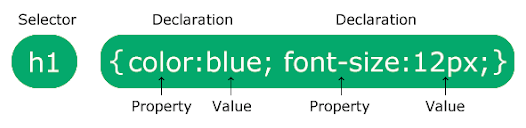

<h1 align="center">CSS Notes</h1>

- [1. Introduction](#1-introduction)
  - [1.1. What is CSS:](#11-what-is-css)
  - [1.2. CSS Syntax:](#12-css-syntax)
  - [1.3. Different Ways to Add CSS:](#13-different-ways-to-add-css)
  - [1.4. How Different CSS rules works:](#14-how-different-css-rules-works)
    - [1.4.1. Cacading Order:](#141-cacading-order)
    - [1.4.2. Specificity:](#142-specificity)
    - [1.4.3. Source order:](#143-source-order)


# 1. Introduction
## 1.1. What is CSS:
CSS stands for Cascading Style Sheets. HTML gives the structure of the document, and CSS gives the style. 

**Note:**
- Style Sheets: A set of rules that define how HTML elements should look.
- Cascading: cascade (জলপ্রপাত) means a small waterfall flowing over rocks from top to bottom.


So in css cascading refers to the same real cascade where the style is applied from top to bottom by using the cascading order.

## 1.2. CSS Syntax:


here, 
- The selector points to the HTML element you want to style.
- The Declaration block contains one or more declarations separated by semicolons and surrounded by curly braces. Each Declaration includes a CSS property name and a value, separated by a colon.

## 1.3. Different Ways to Add CSS:
There are three ways of inserting a style sheet:

1. Inline CSS

```html
<!DOCTYPE html>
<html lang="en">

<head>
    <meta charset="UTF-8">
    <meta name="viewport" content="width=device-width, initial-scale=1.0">
    <title>Document</title>
</head>

<body>
    <h1 style="color: red;">Inline CSS</h1>
</body>

</html>
```   

2. Internal CSS
```html
<!DOCTYPE html>
<html lang="en">
<head>
    <meta charset="UTF-8">
    <meta name="viewport" content="width=device-width, initial-scale=1.0">
    <title>Document</title>
    <style>
        h1{
            color: red;
        }
    </style>
</head>
<body>
    <h1>Internal CSS</h1>
</body>
</html>
```
3. External CSS
```html
<!DOCTYPE html>
<html lang="en">
<head>
    <meta charset="UTF-8">
    <meta name="viewport" content="width=device-width, initial-scale=1.0">
    <title>Document</title>
    <link rel="stylesheet" href="style.css">
</head>
<body>
    <h1>External CSS</h1>
</body>
</html>
```
```css
/* style.css */
h1{
    color: red;
}
```

## 1.4. How Different CSS rules works:
The browser determines which CSS rule to apply using three main factors:
1. Cascading order
2. Specificity
3. Source order

### 1.4.1. Cacading Order:
The cascading order determines which style sheet apply to the html based on priority from top to bottom

1. Inline CSS = 1st priority
2. Internal CSS = 2nd priority
3. External CSS = 3rd priority
4. !important = 4th priority

### 1.4.2. Specificity:
If there are two or more CSS rules that point to the same element, the selector with the highest specificity will win, and its style declaration will be applied to that HTML element.

- 1st priority = Inline CSS
- 2nd priority = Id selector (#navbar, #hero-section)
- 3rd priority = Classes and pseudo-classes selector (.test, :hover)
- 4th priority = Elements and pseudo-elements selector (h1, ::before, ::after)

Example 1: Here, we define a class .test with green color and a p element with red color. Since the class selector has higher specificity than the element selector, the text will appear green.

```html
<!DOCTYPE html>
<html>
<head>
    <style>
        .test {
            color: green;
        }
        p {
            color: red;
        }
    </style>
</head>
<body>
    <p class="test">Hello World!</p>
</body>
</html>
```


Example 2:  In this case, we have:
- .test (class selector, priority: medium) → Green
- p (element selector, priority: low) → Red
- #demo (ID selector, highest priority) → Blue
Since ID selectors have the highest specificity, the text will be blue, overriding both the class and element selectors.

```html
<!DOCTYPE html>
<html lang="en">
<head>
    <meta charset="UTF-8">
    <meta name="viewport" content="width=device-width, initial-scale=1.0">
    <title>Document</title>
    <style>
        .test{
            color:green;
        }
        p{
            color:red;
        }
        #demo{
            color: blue;
        }
    </style>
</head>
<body>
    <p id="demo" class="test">Hello World!</p>
</body>
</html>
```


Example 3: If both have equal specificity the latest rule wins.

```html
<!DOCTYPE html>
<html lang="en">
<head>
    <meta charset="UTF-8">
    <meta name="viewport" content="width=device-width, initial-scale=1.0">
    <title>Document</title>
    <style>
        h1{
            background-color: yellow;
        }
        h1{
            background-color: red;
        }
    </style>
</head>
<body>
    <h1>Heading 1</h1>
</body>
</html>
```


### 1.4.3. Source order: 
When cascading order and specificity are equal, the later rule in the stylesheet wins.

```html
<!DOCTYPE html>
<html lang="en">
<head>
    <meta charset="UTF-8">
    <meta name="viewport" content="width=device-width, initial-scale=1.0">
    <title>Document</title>
    <style>
        h1{
            background-color: yellow;
        }
        h1{
            background-color: red;
        }
    </style>
</head>
<body>
    <h1>Heading 1</h1>
</body> 
```