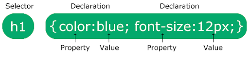

<h1 align="center">CSS Notes</h1>

### 0.1. Table of Contents
- [1. CSS Introduction](#1-css-introduction)
  - [1.1. How To Add CSS](#11-how-to-add-css)
  - [1.2. CSS Comments](#12-css-comments)
- [2. variables](#2-variables)
- [3. Cascading order and Specificity](#3-cascading-order-and-specificity)
  - [3.1. Cascading Order](#31-cascading-order)
  - [3.2. Specificity](#32-specificity)
- [4. Text Formatting](#4-text-formatting)
  - [4.1. text-color](#41-text-color)
  - [4.2. text-alignment](#42-text-alignment)
  - [4.3. text-direction:](#43-text-direction)
  - [4.4. text-decoration:](#44-text-decoration)
  - [4.5. Text-transformation:](#45-text-transformation)
  - [4.6. letter-spacing:](#46-letter-spacing)
  - [4.7. word-spacing:](#47-word-spacing)
  - [4.8. line-height:](#48-line-height)
  - [4.9. text-shadow:](#49-text-shadow)
  - [4.10. font-size:](#410-font-size)
  - [4.11. font-weight:](#411-font-weight)
- [5. Margin](#5-margin)
  - [5.1. margin: auto;](#51-margin-auto)
  - [5.2. Margin Collapse](#52-margin-collapse)
- [6. Border](#6-border)
- [7. Padding](#7-padding)
- [8. Box-Modal](#8-box-modal)
  - [8.1. box-sizing: border-box](#81-box-sizing-border-box)
- [9. Background Properties](#9-background-properties)
- [10. CSS Units](#10-css-units)
- [11. CSS Selectors](#11-css-selectors)
  - [11.1. Simple Selectors](#111-simple-selectors)
    - [11.1.1. Element Selector](#1111-element-selector)
    - [11.1.2. Id Selector](#1112-id-selector)
    - [11.1.3. Class Selector](#1113-class-selector)
    - [11.1.4. Universal Selector](#1114-universal-selector)
    - [11.1.5. Groping Selector](#1115-groping-selector)
  - [11.2. Combinator Selectors](#112-combinator-selectors)
  - [11.3. Pseudo-class Selectors](#113-pseudo-class-selectors)
    - [11.3.1. Pseudo-classes with links](#1131-pseudo-classes-with-links)
      - [11.3.1.1. simple tooltip hover](#11311-simple-tooltip-hover)
    - [11.3.2. input:focus](#1132-inputfocus)
    - [11.3.3. :nth-child()](#1133-nth-child)
- [12. CSS Table](#12-css-table)
  - [12.1. Table Borders:](#121-table-borders)
  - [12.2. Collapsed Table Border:](#122-collapsed-table-border)
  - [12.3. Style Table Borders:](#123-style-table-borders)
  - [12.4. Round Table Borders:](#124-round-table-borders)
  - [12.5. Text-Align:](#125-text-align)
  - [12.6. Vertical-align:](#126-vertical-align)
  - [12.7. Dotted Table Borders:](#127-dotted-table-borders)
  - [12.8. HTML Table Width:](#128-html-table-width)
  - [12.9. HTML Table height:](#129-html-table-height)
  - [12.10. Vertical Table Headers:](#1210-vertical-table-headers)
  - [12.11. Align Table Headers:](#1211-align-table-headers)
  - [12.12. Cell padding:](#1212-cell-padding)
  - [12.13. Cell Spacing:](#1213-cell-spacing)
  - [12.14. HTML Table -Colspan:](#1214-html-table--colspan)
  - [12.15. HTML Table- Rowspan:](#1215-html-table--rowspan)
  - [12.16. HTML Table – Zebra Stripes:](#1216-html-table--zebra-stripes)
  - [12.17. HTML Table – Vertical Zebra Stripes:](#1217-html-table--vertical-zebra-stripes)
  - [12.18. Combine Vertical and Horizontal Zebra Stripes:](#1218-combine-vertical-and-horizontal-zebra-stripes)
  - [12.19. Horizontal Dividers:](#1219-horizontal-dividers)
  - [12.20. Hover able Table:](#1220-hover-able-table)
- [13. Display Property](#13-display-property)
- [14. Position Property](#14-position-property)
  - [14.1. static(default):](#141-staticdefault)
  - [14.2. Relative:](#142-relative)
  - [14.3. absolute:](#143-absolute)
  - [14.4. Sticky:](#144-sticky)
  - [14.5. Fixed:](#145-fixed)
- [15. z-index property](#15-z-index-property)
- [16. Overflow](#16-overflow)
- [17. Opacity](#17-opacity)
- [18. Box shadow](#18-box-shadow)
  - [18.1. Specify a Horizontal and a Vertical shadow:](#181-specify-a-horizontal-and-a-vertical-shadow)
  - [18.2. Specify a color for the shadow:](#182-specify-a-color-for-the-shadow)
  - [18.3. Add a blur effect to the shadow:](#183-add-a-blur-effect-to-the-shadow)
  - [18.4. Set the spread radius of the shadow:](#184-set-the-spread-radius-of-the-shadow)
  - [18.5. Set the inset parameter:](#185-set-the-inset-parameter)
- [19. Media Queries](#19-media-queries)
  - [19.1. CSS Media Types:](#191-css-media-types)
  - [19.2. CSS Media Features:](#192-css-media-features)
  - [19.3. Syntax:](#193-syntax)
  - [19.4. Fully responsive media queries breakpoints:](#194-fully-responsive-media-queries-breakpoints)


## 1. CSS Introduction
CSS = Cascading Style Sheets

It is a stylesheet language used to describe the presentation of a document written in HTML. CSS controls the layout, design, and visual presentation of web pages.



- The selector pints to the HTML element you want to style.
- The Declaration block contains one or more declarations separated by semicolons and surrounded by curly braces.  Each Declaration includes a CSS property name and a value, separated by a colon.

### 1.1. How To Add CSS

 There are three ways of inserting a style sheet:

1. Inline CSS
   
```<h1 style="color: red;">Inline CSS</h1>```

2. Internal CSS
```html
<head>
    <meta charset="UTF-8">
    <meta name="viewport" content="width=device-width, initial-scale=1.0">
    <title>Document</title>
    <style>
        h1{
            color: red;
        }
    </style>
</head>
```
3. External CSS
```html
<head>
    <meta charset="UTF-8">
    <meta name="viewport" content="width=device-width, initial-scale=1.0">
    <title>Document</title>
    <link rel="stylesheet" href="style.css">
</head>
```
```css
h1{
    color: red;
}
```

### 1.2. CSS Comments
```css
/* This is a single line comments */

/* This is 
a multi-line
comment */
```

## 2. variables
A CSS variable (also called a custom property) is a reusable value that you define once and use multiple times in your CSS. CSS variables are usually defined inside the :root selector so that they are available globally.

```css
:root{
    --main-color: blue:
    --main-font: 20px; 
}

body{
    background-color: var(--main-color);
    font-size: var(--main-font);
}
```

## 3. Cascading order and Specificity
### 3.1. Cascading Order 
The cascading order determines which style sheet apply to the html based on priority.
- 1st priority = Inline CSS
- 2nd priority = Internal CSS
- 3rd priority = External CSS

### 3.2. Specificity

If there are two or more CSS rules that point to the same element, the selector with the highest specificity will win, and its style declaration will be applied to that HTML element.

- 1st priority = Inline CSS
- 2nd priority = Id selector (#navbar, #hero-section)
- 3rd priority = Classes and pseudo-classes selector (.test, :hover)
- 4th priority = Elements and pseudo-elements selector (h1, ::before, ::after)

Example 1: Here, we define a class .test with green color and a p element with red color. Since the class selector has higher specificity than the element selector, the text will appear green.

```html
<!DOCTYPE html>
<html>
<head>
    <style>
        .test {
            color: green;
        }
        p {
            color: red;
        }
    </style>
</head>
<body>
    <p class="test">Hello World!</p>
</body>
</html>
```


Example 2:  In this case, we have:
- .test (class selector, priority: medium) → Green
- p (element selector, priority: low) → Red
- #demo (ID selector, highest priority) → Blue
Since ID selectors have the highest specificity, the text will be blue, overriding both the class and element selectors.

```html
<!DOCTYPE html>
<html lang="en">
<head>
    <meta charset="UTF-8">
    <meta name="viewport" content="width=device-width, initial-scale=1.0">
    <title>Document</title>
    <style>
        .test{
            color:green;
        }
        p{
            color:red;
        }
        #demo{
            color: blue;
        }
    </style>
</head>
<body>
    <p id="demo" class="test">Hello World!</p>
</body>
</html>
```


Example 3: If both have equal specificity the latest rule wins.

```html
<!DOCTYPE html>
<html lang="en">
<head>
    <meta charset="UTF-8">
    <meta name="viewport" content="width=device-width, initial-scale=1.0">
    <title>Document</title>
    <style>
        h1{
            background-color: yellow;
        }
        h1{
            background-color: red;
        }
    </style>
</head>
<body>
    <h1>Heading 1</h1>
</body>
</html>
```


## 4. Text Formatting
### 4.1. text-color
- color: value; 
### 4.2. text-alignment
- text-alignment: left(default),center, right, justify

  

### 4.3. text-direction:
```css
  p.ex1 {
            direction: rtl;
            unicode-bidi: bidi-override;
        }
```	
  

```css
    p.ex1 {
            direction: rtl;
        }
```
  

### 4.4. text-decoration:	

```css
        h1 {
            text-decoration: overline;
        }


        h2 {
            text-decoration: line-through;
        }


        h3 {
            text-decoration: underline;
        }


        h4 {
            text-decoration: none; /* (Removes any default text decoration, useful for removing links and lists default decoration)*/
        }
```

  

### 4.5. Text-transformation:

```css
        h1 {
            text-transform: uppercase;
        }


        h2 {
            text-transform: capitalize;
        }


        h3 {
            text-transform: lowercase;
        }
```

  

### 4.6. letter-spacing:	

```css
 h1 {
            letter-spacing: -3px;
        }


        p {
            letter-spacing: 10px;
        }
```
  

### 4.7. word-spacing:	

```css
        p.normal{
            word-spacing: normal;
        }


        p.wide {
            word-spacing: 10px;
        }


        p.narrow {
            word-spacing: -2px;
        }

```

  

### 4.8. line-height:	

```css
        p {
            line-height: 80px;
        }
```


### 4.9. text-shadow:	
first 2px specify the  horizontal shadow and the 2nd 2px specify the vertical shadow:

```css
  h1 {
            text-shadow: 2px 2px;
        }
```

  

Next, add color (red) to the shadow:

```css
        h1 {
            text-shadow: 2px 2px red;
        }
```


Then, add a blur effect (5px) to the shadow:

```css
        h1 {
            text-shadow: 2px 2px 5px red;
        }
```


### 4.10. font-size:

- font-size: value;
  
### 4.11. font-weight:

- 100(thin)
- 200(extra-light)
- 300(light)
- 400(regular)
- 500(medium)
- 600(semi bold)
- 700(bold)
- 800(extrabold)
- 900(black)


## 5. Margin
The CSS margin properties are used to crate space around outside the elements. 
- margin-top
- margin-right
- margin-bottom
- margin-left

To shorten the code, it is possible to specify all the margin properties in one property. 
- margin: 25px 50px 75px 100px;
  - top margin is 25px
  - right margin is 50px
  - bottom margin is 75px
  - left margin is 100px

if the margin property had three values:
  - margin: 25px 50px 75px;
  - top margin is 25px
  - right and left margins are 50px
  - bottom margin is 75px
  
if the margin property has two values:
  - margin: 25px 50px;
  - top and bottom margins are 25px
  - right and left margins are 50px

if the margin property has one value:
  - margin: 25px;
all four margins are 25px


### 5.1. margin: auto;
You can set the margin property to auto to horizontally center the element within its container. The element will then take up the specified width, and the remaining space will be split equally between the left and right margins.

```css
        div {
            border: 1px solid red;
            width: 300px;
            margin: auto;
        }
```


### 5.2. Margin Collapse
Top and bottom margins of elements are sometimes collapsed into a single margin that is equal to the largest of the two margins. This does not happen on left and right margins! Only top and bottom margins!
In the below example, the `<h1>` element has a bottom margin of 50px and the `<h2>` element has a top margin set to 20px. Common sense would seem to suggest that the vertical margin between the `<h1>` and the `<h2>` would be a total of 70px (50px + 20px). But due to margin collapse, the actual margin ends up being 50px.

```css
        h1 {
            margin: 0 0 50px 0;
        }


        h2 {
            margin: 20px 0 0 0;
        }
```


## 6. Border
The border property is a shorthand property for the following individual border properties:
- border-width
- border-style
- border-color

```css
  p {
            border: 5px solid red;
        }
```
```css
        p {
            border-left: 5px solid red;
        }
```
```css
        p {
            border-style: solid;
            border-right-color: red;
        }
```
```css
       p {
            border: 5px solid red;
            border-radius: 10px;
        }
```


## 7. Padding
Padding is used to create space inside an element, between its content and border (if any). Padding Increases the inner space of an element and it does not affect the element’s margin. There are properties for setting the padding for each side of an element:
- padding-top
- padding-right
- padding-bottom
- padding-left
Note: The padding doesn’t have auto value.

To shorten the code, it is possible to specify all the padding properties in one property. 

```css
        div {
            padding: 25px 50px 75px 100px;
            border: 1px solid red;
        }
```


## 8. Box-Modal
In CSS, the term box model is used when taking about design and layout. The CSS box model is essentially a box that warps around every HTML element. It consists of: content, padding, borders, and margins. The image below illustrates the box model:


Example 1:


### 8.1. box-sizing: border-box 
By default, when we set width and height for an element, only the content inside the element gets that size. However, if we add padding and borders, they increase the total size of the element, often breaking layouts. 

```css
        .div1 {
            width: 300px;
            height: 100px;
            border: 1px solid red;
            margin-bottom: 10px;
        }


        .div2 {
            width: 300px;
            height: 100px;
            border: 1px solid red;
            padding: 25px;
        }
```


When we apply box-sizing: border-box;, the total width and height include content, padding, and border.

```css
        .div1 {
            width: 300px;
            height: 100px;
            border: 1px solid red;
            margin-bottom: 10px;
            box-sizing: border-box;
        }


        .div2 {
            width: 300px;
            height: 100px;
            border: 1px solid red;
            padding: 25px;
            box-sizing: border-box;
        }
```


**Note:** it’s recommended to apply these CSS in globally:

```css
        * {
            margin: 0;
            padding: 0;
            box-sizing: border-box;
        }
```

## 9. Background Properties
- background-color: value;
- background-image: url(“”);
if you want to add multiple background images, it will be separated by commas.

```html
<head>
    <style>
        div {
            width: 600px;
            height: 300px;
            border: 1px solid red;
            background-image: url(assets/boy.svg), url(assets/ring.svg);
            background-position: right bottom, left top;
            background-repeat: no-repeat, no-repeat;
        }
    </style>
</head>

```


Multiple background images can be specified using the background shorthand property.

```html
    <style>
        div {
            width: 600px;
            height: 300px;
            border: 1px solid red;
            background: url(assets/boy.svg) no-repeat right bottom, url(assets/ring.svg) no-repeat left top;
        }
    </style>
```

- background-position: top, bottom, left, right, center;    
  you can also use them: top left, top center, top right, bottom right, 50px 100px, 20% 40%, top 30px left20px
- background-repeat: no-repeat, repeat, repeat-x, repeat-y;
- background-size: length, percentages, auto(default), cover, contain;


cover tells the browser to make sure the image always covers the entire container, even if it has to stretch the image or cut a little bit off one of the edges. contain, on the other hand, says to always show the whole image, even if that leaves a little space to the sides or bottom.

- background-position-x: center, left, right;
- background-position-y: center, top, bottom;
- background-attachment: fixed, scroll (default);

```html
   <style>
        body {
            background-image: url(assets/boy.svg);
            background-repeat: no-repeat;
            background-attachment: fixed;
        }
    </style> 
```


  

## 10. CSS Units

## 11. CSS Selectors
### 11.1. Simple Selectors
#### 11.1.1. Element Selector
#### 11.1.2. Id Selector
#### 11.1.3. Class Selector
#### 11.1.4. Universal Selector
#### 11.1.5. Groping Selector
### 11.2. Combinator Selectors
### 11.3. Pseudo-class Selectors
#### 11.3.1. Pseudo-classes with links
##### 11.3.1.1. simple tooltip hover
#### 11.3.2. input:focus
#### 11.3.3. :nth-child()


## 12. CSS Table
### 12.1. Table Borders:	
### 12.2. Collapsed Table Border:	
### 12.3. Style Table Borders:	
### 12.4. Round Table Borders:	
### 12.5. Text-Align:	
### 12.6. Vertical-align:	
### 12.7. Dotted Table Borders:	
### 12.8. HTML Table Width:	
### 12.9. HTML Table height:	
### 12.10. Vertical Table Headers:	
### 12.11. Align Table Headers:	
### 12.12. Cell padding:	
### 12.13. Cell Spacing:	
### 12.14. HTML Table -Colspan:	
### 12.15. HTML Table- Rowspan:	
### 12.16. HTML Table – Zebra Stripes:	
### 12.17. HTML Table – Vertical Zebra Stripes:	
### 12.18. Combine Vertical and Horizontal Zebra Stripes:	
### 12.19. Horizontal Dividers:	
### 12.20. Hover able Table:


## 13. Display Property

## 14. Position Property
### 14.1. static(default):
### 14.2. Relative:	
### 14.3. absolute:	
### 14.4. Sticky:	
### 14.5. Fixed:	


## 15. z-index property

## 16. Overflow

## 17. Opacity

## 18. Box shadow
### 18.1. Specify a Horizontal and a Vertical shadow:	
### 18.2. Specify a color for the shadow:	
### 18.3. Add a blur effect to the shadow:	
### 18.4. Set the spread radius of the shadow:	
### 18.5. Set the inset parameter:	


## 19. Media Queries
### 19.1. CSS Media Types:	
### 19.2. CSS Media Features:	
### 19.3. Syntax:	
### 19.4. Fully responsive media queries breakpoints:


